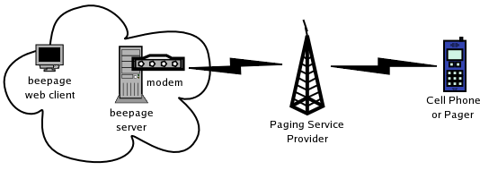

beepagePHP
==========


## Features

BeepagePHP can dial any standard paging dispatcher,
such as Sprint PCS, Metrocall, Nextel, Cingular, or
other common paging companies.



The web interface allows a user to...

* Send text messages to any pager and almost any cell phone
* Add subscriber info
* Edit groups of subscribers
* Add service info (e.g., Metrocall dispatcher)

When a user composes a page in the web interface, the page
is queued on the server for immediate sending. The server uses a single
modem to dial up each queued service provider (such as Metrocall), then
transmits all pages that have been queued for that provider.


## Installation 

BeepagePHP requires the `-s sender` functionality 
provided by the version of beep in the
[enhanced version of beepage](https://github.com/jumanjiman/beepage/tree/sender).
This enables beepagePHP to pass the contents of the `REMOTE_USER`
server variable to the beep client running on localhost. 
Consequently, the cell phone or pager that receives the page displays the name
of the originating sender and not the name of the httpd user account from the 
web server.

1. Build and install [beepage](https://github.com/jumanjiman/beepage/tree/sender).

2. Clone [beepagePHP](https://github.com/jumanjiman/beepagePHP) into an
   appropriate content directory, such as `/var/www/html/beepage`.

3. Update your apache config to implement basic authentication 
   on the `beepage/` directory. Consult the
   [Apache how-to](http://httpd.apache.org/docs-2.0/howto/auth.html)
   if you are unsure how to accomplish this.

   Here is an example `/etc/httpd/conf.d/beepage.conf` file:

   ```
   ##################################################
   #
   #  httpd configuration settings for use with beepagephp
   #
   # establish a .htaccess file for general usage
   <Directory /var/www/html/beepage/>
   	AllowOverride AuthConfig
	<FilesMatch "\.inc$">
	    Order Allow,Deny
	    Deny from all
	</FilesMatch>
   </Directory>
   
   # establish a different .htaccess file for the admin
   # directory
   <Directory /var/www/html/beepage/admin/>
   	AllowOverride AuthConfig
	<FilesMatch "\.inc$">
	    Order Allow,Deny
	    Deny from all
	</FilesMatch>
   </Directory>
   ##################################################
   ```

4. Update the permissions on your `beepage/etc`
   files as follows (assuming httpd runs as group apache):

   ```
   chgrp apache etc/{users,aliases,services}
   chmod 770 etc/{users,aliases,services}
   ```

### Notes

A. beepagePHP assumes that `beepaged` is running on localhost.
   You may need to edit `beepagePHP/inc/vars.inc` if 
   you modified the location of files in the beepage Makefile.

B. Sample user, group (aliases), and services files are 
   included with the beepage tarball in the downloads section.

C. Check your host-based firewall rules to ensure that localhost
   (on which httpd is running) can connect to itself on port 6661.

D. Please configure web server to authenticate your users.
   Otherwise:

   * Anybody visiting your web server will be able to send messages
     (this may be what you want).

   * Outgoing messages will show "From: apache" assuming that
     httpd is running as apache.

### TAP phone numbers

The following pages list TAP phone numbers for common 
cell phone and paging service providers:

* http://www.notepage.net/tap-phone-numbers.htm
* http://sendpage.org/pc/


## Credits

Beepage is a Unix-based, Internet-aware text paging system that implements the Telocator
Alphanumeric Protocol (TAP) and lives at <a href="http://beepage.org">http://beepage.org</a>.

BeepagePHP originally lived at
[~~http://beepagephp.sourceforge.net~~](http://beepagephp.sourceforge.net).


## License

[MIT](http://git.io/htwGXw)
